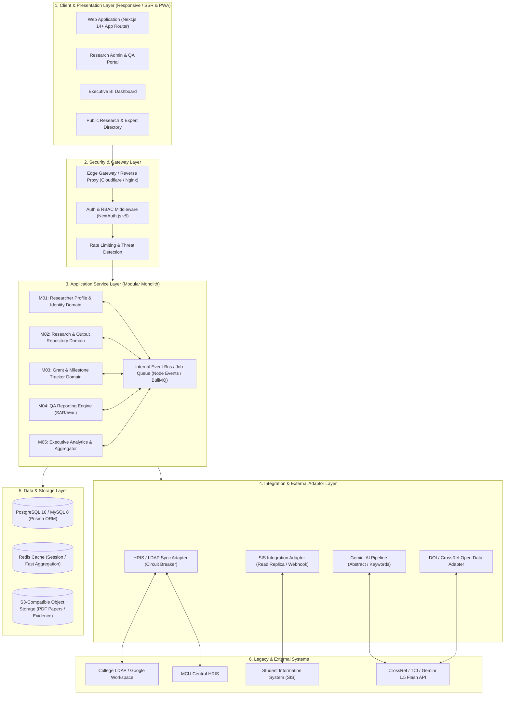
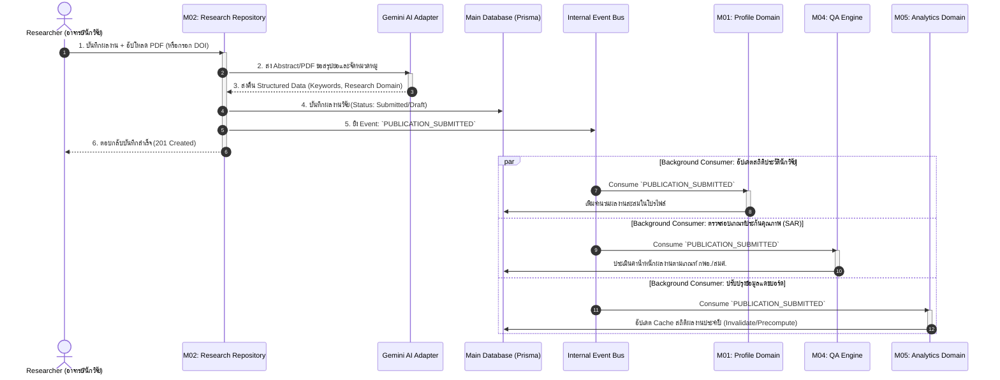

# System Architecture Document
## LBC-RIS: Academic & Research Information System
**วิทยาลัยสงฆ์เลย (Loei Buddhist College)**

---

## 1. High-Level Architecture Overview
ระบบ **LBC-RIS** ได้รับการออกแบบตามสถาปัตยกรรม **Modular Monolith บน Next.js 14+ (App Router)** ซึ่งรวม Frontend, Backend APIs (Server Actions & Route Handlers), และ Data Access Layer (Prisma ORM) ไว้ในชุดโค้ดเดียวกันเพื่อความรวดเร็วในการพัฒนาด้วยเทคนิค **Vibe Code** มี Type-Safety แบบ End-to-End และขจัดปัญหา Network Overhead ระหว่างเซอร์วิส



---

## 2. Cross-Module Event & Data Flow Sequence
ตัวอย่างการทำงาน: **เมื่อนักวิจัยบันทึกผลงานตีพิมพ์ใหม่ (Publication Created)** ระบบทำการวิเคราะห์ด้วย AI, จัดเก็บ, แจ้งเตือน และประมวลผลสำหรับระบบ QA และแดชบอร์ดผู้บริหาร



---

## 3. Technology Stack & Rationale

| Layer | Technology | Rationale & Vibe Code Alignment | License |
| :--- | :--- | :--- | :--- |
| **Frontend & SSR** | **Next.js 14+ (App Router)** | Full-stack ในภาษา TypeScript เดียวกัน รองรับ SSR/SSG สำหรับหน้าค้นหาและโปรไฟล์สาธารณะ เหมาะกับ AI-assisted coding | MIT |
| **Styling & UI Kit** | **Tailwind CSS + shadcn/ui** | โค้ดคอมโพเนนต์เป็นมิตรกับ AI agent ปรับแต่งธีมได้เร็ว ตรงตาม Institutional Design System | MIT |
| **Backend & APIs** | **Server Actions & Route Handlers** | ลดความซ้ำซ้อนของการทำ API Layer แยก สามารถสร้าง Type-safe RPC ร่วมกับ Zod ได้ทันที | MIT |
| **ORM & Database** | **Prisma ORM + PostgreSQL 16** | Type-safe Database Access ป้องกัน Runtime SQL Error มี Schema Definition ที่ชัดเจน รองรับ Full-text Search ในตัว | Apache 2.0 / PostgreSQL |
| **Authentication** | **NextAuth.js v5 (Auth.js)** | รองรับการทำ Multi-Provider: LDAP สำหรับบุคลากรภายใน, Google Workspace ของวิทยาลัย, และ Local Fallback | ISC |
| **AI Integration** | **Google Gemini 1.5 Flash (via SDK)** | ค่า Latency ต่ำ รองรับ Context Window ขนาดใหญ่ สกัดบทคัดย่อภาษาไทยและบาลี-สันสกฤตได้แม่นยำ และประหยัดงบประมาณ | Commercial API / SDK Apache 2.0 |
| **Storage & Caching** | **Cloudflare R2 / S3 API + Redis** | เก็บไฟล์ Full-text PDF โดยไม่มีค่า Egress และใช้ Redis สำหรับ Session และ Cache สถิติ | Apache 2.0 |

---

## 4. Project Directory Structure

```text
RIS/
├── prisma/
│   ├── schema.prisma          # Database Schema & Entity Relationships
│   └── seed.ts                # Master Data & Initial Administrative Accounts
├── public/                    # Static Assets (Logos, Icons)
├── src/
│   ├── app/                   # Next.js App Router Pages & Layouts
│   │   ├── (auth)/            # Login, Forgot Password
│   │   ├── (dashboard)/       # Authenticated Portal
│   │   │   ├── profile/       # M01: Researcher Profile Management
│   │   │   ├── research/      # M02: Publication & Output Repository
│   │   │   ├── grants/        # M03: Grant & Milestone Tracker
│   │   │   ├── qa-reports/    # M04: SAR & Quality Assurance Export
│   │   │   ├── analytics/     # M05: Executive BI Dashboard
│   │   │   └── layout.tsx     # Dashboard Shared Layout & Navigation
│   │   ├── directory/         # Public Researcher & Publication Directory
│   │   ├── api/               # Next.js Route Handlers & Webhooks
│   │   ├── layout.tsx         # Root Layout
│   │   └── page.tsx           # Landing Page
│   ├── components/            # Reusable UI Components
│   │   ├── ui/                # shadcn/ui base primitives (Button, Dialog, etc.)
│   │   ├── shared/            # Header, Sidebar, Footer, EmptyState, LoadingSkeleton
│   │   └── modules/           # Domain-specific UI (ProfileCard, PublicationList, etc.)
│   ├── lib/                   # Shared Utilities & Config
│   │   ├── prisma.ts          # Prisma Singleton Client
│   │   ├── auth.ts            # NextAuth Configuration & Session Helpers
│   │   ├── gemini.ts          # Google Gemini AI Integration Client
│   │   └── utils.ts           # Formatters, Date (Buddhist Era B.E.), Helpers
│   ├── types/                 # Global TypeScript Definitions
│   └── actions/               # Server Actions (Mutations & Business Logic)
├── .env.example
├── package.json
├── tailwind.config.ts
└── tsconfig.json
```

---

## 5. Resilience & Fault Tolerance Strategy

1. **Circuit Breaker for External APIs:**
   * หากระบบ LDAP หรือ Google Workspace ล่ม ระบบจะอนุญาตให้ใช้ Local Credentials (Username/Password เข้ารหัส bcrypt) เพื่อไม่ให้ระงับการทำงาน
   * หาก Google Gemini API ล่มหรือเกิน Quota ระบบจะสลับเป็นโหมด **Manual Abstract Entry** ทันทีโดยไม่บล็อกการบันทึกข้อมูล
2. **Data Consistency & Eventual Sync:**
   * การเปลี่ยนแปลงข้อมูลสำคัญจะบันทึกลงในฐานข้อมูลหลักก่อน (ACID Transaction)
   * สถิติในแดชบอร์ดและรายงาน QA จะถูกคำนวณแบบ Asynchronous Background Jobs เพื่อลดเวลา Response Time ของผู้ใช้งาน
3. **Database Backup Strategy:**
   * Automated Daily Snapshot สำหรับฐานข้อมูล PostgreSQL
   * Write-Ahead Logging (WAL) สำหรับ Point-in-Time Recovery (PITR)
