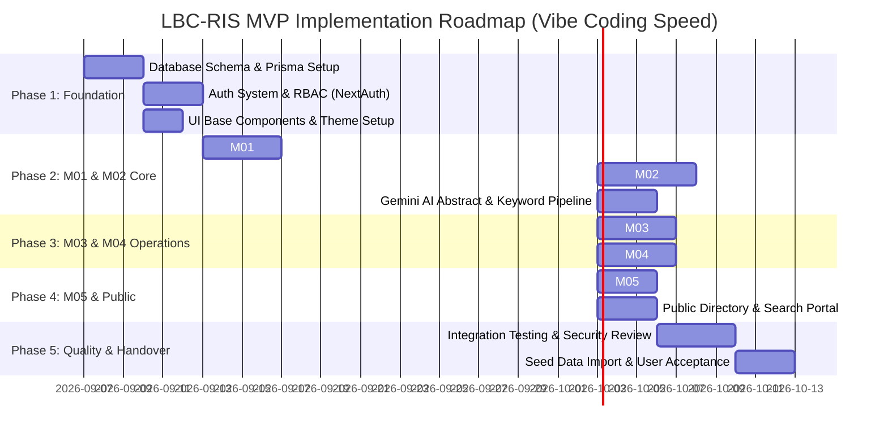

# Engineering Implementation Plan
## LBC-RIS: Academic & Research Information System
**วิทยาลัยสงฆ์เลย (Loei Buddhist College)**

---

## 1. Project Phasing & Roadmap Overview

---

## 2. Detailed Atomic Task Breakdown

### Phase 1: Foundation & Data Infrastructure
* **TASK-101: Prisma Schema & Database Initialization**
  - *Description:* ติดตั้ง Prisma ORM, กำหนด Schema ใน `prisma/schema.prisma` ตาม `schema.md`, และรัน Migration
  - *Files:* `prisma/schema.prisma`, `src/lib/prisma.ts`
  - *Acceptance Criteria:* `npx prisma db push` สำเร็จ และสามารถ Query ผ่าน Prisma Client ได้
* **TASK-102: Master Data Seed Script**
  - *Description:* สร้างข้อมูลตั้งต้นคณะ/ภาควิชาในวิทยาลัยสงฆ์เลย, บัญชีผู้ดูแลระบบ (Super Admin), และตัวอย่างอาจารย์
  - *Files:* `prisma/seed.ts`, `package.json`
  - *Acceptance Criteria:* รัน `npx prisma db seed` ข้อมูล Master Data ถูกสร้างลงฐานข้อมูลครบถ้วน
* **TASK-103: Authentication & Multi-Role Middleware**
  - *Description:* ติดตั้ง NextAuth v5 กำหนด Credentials Provider และ Session Callback จัดการ Role (RESEARCHER, ADMIN, QA_OFFICER, EXECUTIVE)
  - *Files:* `src/lib/auth.ts`, `src/middleware.ts`, `src/app/(auth)/login/page.tsx`
  - *Acceptance Criteria:* ล็อกอินสำเร็จ สามารถอ่าน Role ใน Session และ Redirect ไปยัง Dashboard ตามสิทธิ์ได้ถูกต้อง

---

### Phase 2: M01 Researcher Profile & M02 Publications
* **TASK-201: Researcher Profile Form & Identity Handler**
  - *Description:* พัฒนาหน้าจัดการโปรไฟล์ที่รองรับทั้งสมณศักดิ์ ฉายา นามสกุล และตำแหน่งวิชาการ
  - *Files:* `src/app/(dashboard)/profile/page.tsx`, `src/actions/profile.ts`
  - *Acceptance Criteria:* พระภิกษุและคฤหัสถ์สามารถบันทึกข้อมูลส่วนตัว ประวัติการศึกษา และคีย์เวิร์ดความเชี่ยวชาญได้สมบูรณ์
* **TASK-202: Publication Management CRUD & File Upload**
  - *Description:* พัฒนาระบบบันทึกผลงาน 4 ประเภท (วารสาร, ประชุมวิชาการ, ตำรา, นวัตกรรม) รองรับการระบุ TCI/Scopus และแนบไฟล์ PDF
  - *Files:* `src/app/(dashboard)/research/page.tsx`, `src/actions/publication.ts`
  - *Acceptance Criteria:* บันทึกผลงานสำเร็จ แสดงรายการผลงานพร้อมสถานะ (Draft, Submitted, Verified) ได้ถูกต้อง
* **TASK-203: Gemini AI Abstract & Tag Extraction Integration**
  - *Description:* เชื่อมต่อ Google Gemini 1.5 Flash API สกัดประเด็นสำคัญและแท็กคีย์เวิร์ดจากบทคัดย่อหรือไฟล์ PDF
  - *Files:* `src/lib/gemini.ts`, `src/components/modules/AiSummaryModal.tsx`
  - *Acceptance Criteria:* ผู้ใช้คลิก "สรุปด้วย AI" แล้วระบบเติมข้อความสรุปและคีย์เวิร์ดลงในฟอร์มอัตโนมัติใน 3 วินาที

---

### Phase 3: M03 Grant Tracker & M04 QA Export
* **TASK-301: Grant & Milestone Management**
  - *Description:* บันทึกโครงการวิจัย ทุนภายใน/ภายนอก วงเงิน และติดตามงวดงาน (Milestones)
  - *Files:* `src/app/(dashboard)/grants/page.tsx`, `src/actions/grants.ts`
  - *Acceptance Criteria:* แสดงรายการโครงการและสถานะงวดงาน มีตัวระบุสีเขียว/เหลือง/แดงสำหรับงวดที่ใกล้ถึงกำหนด
* **TASK-302: QA Weight Calculation & Criteria Engine**
  - *Description:* สร้าง Logic คำนวณค่าน้ำหนักผลงานวิจัยตามเกณฑ์ กพอ. และ สมศ. (เช่น TCI-1 = 0.8, Scopus = 1.0)
  - *Files:* `src/lib/qa-calculator.ts`
  - *Acceptance Criteria:* คำนวณคะแนนตามสัดส่วนผู้แต่ง (Author Share) และแสดงผลได้อย่างแม่นยำ
* **TASK-303: SAR Report Excel Export Engine**
  - *Description:* ใช้ไลบรารี `exceljs` หรือ `xlsx` สร้างไฟล์ Excel สรุปผลงานตามรอบปีการศึกษาพร้อมค่าน้ำหนักคะแนน
  - *Files:* `src/app/(dashboard)/qa-reports/page.tsx`, `src/actions/export-qa.ts`
  - *Acceptance Criteria:* ดาวน์โหลดไฟล์ Excel ที่มีโครงสร้างคอลัมน์ตรงตามแบบฟอร์ม SAR ของวิทยาลัยสงฆ์เลยได้ในคลิกเดียว

---

### Phase 4: M05 Executive Dashboard & Public Portal
* **TASK-401: Executive Analytics Dashboard**
  - *Description:* สร้างหน้าแดชบอร์ดสรุปผลสำหรับผู้บริหาร (KPI Cards, กราฟแนวโน้มผลงานย้อนหลัง, แผนภูมิสัดส่วนงบประมาณ)
  - *Files:* `src/app/(dashboard)/analytics/page.tsx`, `src/components/modules/AnalyticsCharts.tsx`
  - *Acceptance Criteria:* กราฟแสดงผลสวยงาม รวดเร็ว รองรับการแสดงผลบนจอประชุมหรือ Tablet ของผู้บริหาร
* **TASK-402: Public Directory & Search Interface**
  - *Description:* หน้าค้นหาอาจารย์และผลงานวิจัยสำหรับบุคคลภายนอกและนิสิต (SEO-friendly)
  - *Files:* `src/app/directory/page.tsx`, `src/app/directory/[id]/page.tsx`
  - *Acceptance Criteria:* บุคคลภายนอกสามารถค้นหาผลงานและประวัติอาจารย์ได้โดยไม่ต้องล็อกอิน

---

## 3. Verification & Testing Strategy
1. **Automated Validation:**
   * ทุก Data Mutation ต้องผ่าน `zod` schema validation เพื่อป้องกันข้อมูลผิดรูปแบบ
   * รัน `tsc --noEmit` เพื่อตรวจสอบความถูกต้องของ TypeScript Types 100% ก่อน Commit
2. **Acceptance Testing:**
   * ทดสอบ Use Case ของพระภิกษุ (ไม่มีนามสกุล มีฉายา) ว่าแสดงผลและออกรายงานได้ถูกต้อง
   * ทดสอบ Export ข้อมูล QA เปรียบเทียบกับแบบฟอร์มกระดาษเดิมของวิทยาลัย
