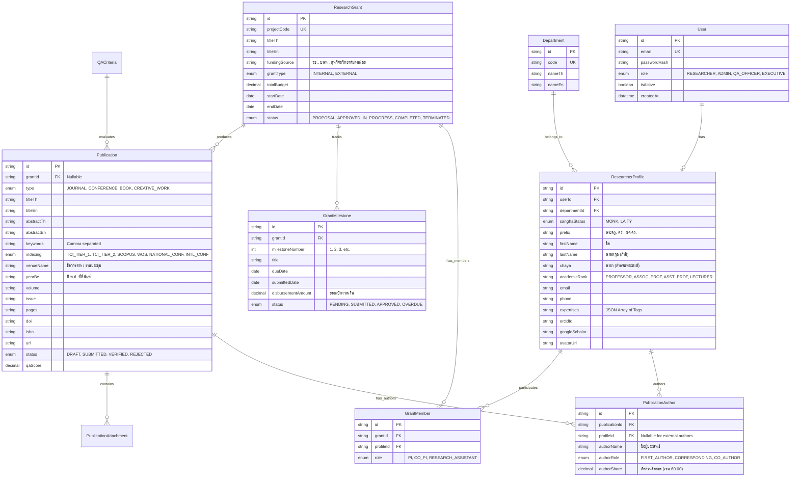

# Database Schema & Entity Design
## LBC-RIS: Academic & Research Information System
**วิทยาลัยสงฆ์เลย (Loei Buddhist College)**

---

## 1. Entity Relationship Diagram (ERD)



---

## 2. Prisma Schema Specification (`schema.prisma`)

```prisma
datasource db {
  provider = "postgresql" // หรือ mysql
  url      = env("DATABASE_URL")
}

generator client {
  provider = "prisma-client-js"
}

enum Role {
  RESEARCHER
  RESEARCH_ADMIN
  QA_OFFICER
  EXECUTIVE
}

enum SanghaStatus {
  MONK    // พระภิกษุ / สามเณร
  LAITY   // คฤหัสถ์
}

enum AcademicRank {
  NONE              // ไม่มีตำแหน่งวิชาการ
  LECTURER          // อาจารย์
  ASSISTANT_PROF    // ผู้ช่วยศาสตราจารย์ (ผศ.)
  ASSOCIATE_PROF    // รองศาสตราจารย์ (รศ.)
  PROFESSOR         // ศาสตราจารย์ (ศ.)
}

enum PublicationType {
  JOURNAL           // บทความวารสารวิชาการ
  CONFERENCE        // รายงานการประชุมวิชาการ
  BOOK_TEXTBOOK     // หนังสือ / ตำรา
  CREATIVE_WORK     // ผลงานสร้างสรรค์ / นวัตกรรมเชิงพื้นที่
}

enum IndexingTier {
  TCI_TIER_1
  TCI_TIER_2
  SCOPUS_Q1
  SCOPUS_Q2
  SCOPUS_Q3
  SCOPUS_Q4
  WOS
  NATIONAL_CONF
  INTERNATIONAL_CONF
  GENERAL
}

enum PublicationStatus {
  DRAFT
  SUBMITTED
  VERIFIED
  REJECTED
}

enum GrantType {
  INTERNAL
  EXTERNAL
}

enum GrantStatus {
  PROPOSAL
  APPROVED
  IN_PROGRESS
  COMPLETED
  TERMINATED
}

enum MilestoneStatus {
  PENDING
  SUBMITTED
  APPROVED
  OVERDUE
}

enum AuthorRole {
  FIRST_AUTHOR
  CORRESPONDING
  CO_AUTHOR
}

model User {
  id            String             @id @default(cuid())
  email         String             @unique
  passwordHash  String?
  role          Role               @default(RESEARCHER)
  isActive      Boolean            @default(true)
  createdAt     DateTime           @default(now())
  updatedAt     DateTime           @updatedAt
  profile       ResearcherProfile?

  @@map("users")
}

model Department {
  id          String              @id @default(cuid())
  code        String              @unique
  nameTh      String
  nameEn      String?
  profiles    ResearcherProfile[]

  @@map("departments")
}

model ResearcherProfile {
  id              String             @id @default(cuid())
  userId          String             @unique
  user            User               @relation(fields: [userId], references: [id], onDelete: Cascade)
  departmentId    String
  department      Department         @relation(fields: [departmentId], references: [id])
  
  sanghaStatus    SanghaStatus       @default(LAITY)
  prefix          String             // เช่น "พระมหา", "ดร.", "ผศ.ดร."
  firstName       String
  lastName        String?            // พระภิกษุบางรูปอาจไม่มีนามสกุล
  chaya           String?            // ฉายา เช่น "ฐิตธมฺโม", "วชิรญาโณ"
  academicRank    AcademicRank       @default(NONE)
  
  email           String?
  phone           String?
  expertises      String[]           // Array of tags/keywords
  orcidId         String?
  googleScholar   String?
  avatarUrl       String?
  
  authorships     PublicationAuthor[]
  grantMemberships GrantMember[]
  
  createdAt       DateTime           @default(now())
  updatedAt       DateTime           @updatedAt

  @@map("researcher_profiles")
}

model Publication {
  id              String              @id @default(cuid())
  grantId         String?
  grant           ResearchGrant?      @relation(fields: [grantId], references: [id], onDelete: SetNull)
  
  type            PublicationType
  titleTh         String
  titleEn         String?
  abstractTh      String?             @db.Text
  abstractEn      String?             @db.Text
  keywords        String[]
  
  indexing        IndexingTier        @default(GENERAL)
  venueName       String              // ชื่อวารสาร หรือชื่องานประชุม
  yearBe          Int                 // ปี พ.ศ. เช่น 2567
  volume          String?
  issue           String?
  pages           String?
  doi             String?
  isbn            String?
  url             String?
  
  fileUrl         String?             // Path / URL ของไฟล์ Full-text PDF
  status          PublicationStatus   @default(DRAFT)
  qaScore         Decimal             @default(0.00) @db.Decimal(5, 2)
  verifiedAt      DateTime?
  verifiedBy      String?
  
  authors         PublicationAuthor[]
  createdAt       DateTime            @default(now())
  updatedAt       DateTime            @updatedAt

  @@index([yearBe])
  @@index([type])
  @@index([indexing])
  @@map("publications")
}

model PublicationAuthor {
  id              String             @id @default(cuid())
  publicationId   String
  publication     Publication        @relation(fields: [publicationId], references: [id], onDelete: Cascade)
  profileId       String?
  profile         ResearcherProfile? @relation(fields: [profileId], references: [id], onDelete: SetNull)
  
  authorName      String             // ชื่อผู้แต่งที่ปรากฏในบทความ
  authorRole      AuthorRole         @default(CO_AUTHOR)
  authorShare     Decimal            @default(100.00) @db.Decimal(5, 2) // สัดส่วน %

  @@map("publication_authors")
}

model ResearchGrant {
  id              String              @id @default(cuid())
  projectCode     String              @unique
  titleTh         String
  titleEn         String?
  fundingSource   String              // เช่น "กองทุนวิจัย มจร.", "บพท."
  grantType       GrantType           @default(INTERNAL)
  totalBudget     Decimal             @db.Decimal(12, 2)
  startDate       DateTime
  endDate         DateTime
  status          GrantStatus         @default(IN_PROGRESS)
  
  members         GrantMember[]
  milestones      GrantMilestone[]
  publications    Publication[]
  
  createdAt       DateTime            @default(now())
  updatedAt       DateTime            @updatedAt

  @@map("research_grants")
}

model GrantMilestone {
  id                  String           @id @default(cuid())
  grantId             String
  grant               ResearchGrant    @relation(fields: [grantId], references: [id], onDelete: Cascade)
  milestoneNumber     Int
  title               String
  dueDate             DateTime
  submittedDate       DateTime?
  disbursementAmount  Decimal          @db.Decimal(12, 2)
  status              MilestoneStatus  @default(PENDING)
  deliverableFileUrl  String?

  @@map("grant_milestones")
}

model GrantMember {
  id            String             @id @default(cuid())
  grantId       String
  grant         ResearchGrant      @relation(fields: [grantId], references: [id], onDelete: Cascade)
  profileId     String
  profile       ResearcherProfile  @relation(fields: [profileId], references: [id], onDelete: Cascade)
  role          String             // "หัวหน้าโครงการ", "ผู้ร่วมวิจัย"

  @@unique([grantId, profileId])
  @@map("grant_members")
}
```

---

## 3. Data Dictionary & Key Fields Considerations
1. **การจัดการอัตลักษณ์สงฆ์ (Buddhist Identity Fields):**
   * ฟิลด์ `chaya` (ฉายา) และ `prefix` (สมณศักดิ์) แยกเป็นอิสระ เพื่อให้สามารถแสดงผลถูกต้อง เช่น *"พระมหาบุญเลิศ อินฺทปญฺโญ, ศ.ดร."*
   * ฟิลด์ `lastName` เป็น Optional เพื่อรองรับพระภิกษุที่ใช้เพียงฉายาทางธรรม
2. **การคิดค่าน้ำหนัก QA (SAR Score):**
   * ฟิลด์ `qaScore` ในตาราง `publications` จะถูกคำนวณอัตโนมัติตามดัชนี เช่น TCI กลุ่ม 1 = 0.80, Scopus = 1.00 และปรับตามสัดส่วนผู้แต่ง `authorShare`
3. **การจัดทำดัชนีค้นหา (Indexing & Search Performance):**
   * ทำ Index บนฟิลด์ `yearBe`, `type`, `indexing`, และ `status` เพื่อให้การ Query สำหรับ Dashboard และรายงาน SAR ประมวลผลได้รวดเร็วระดับมิลลิวินาที
